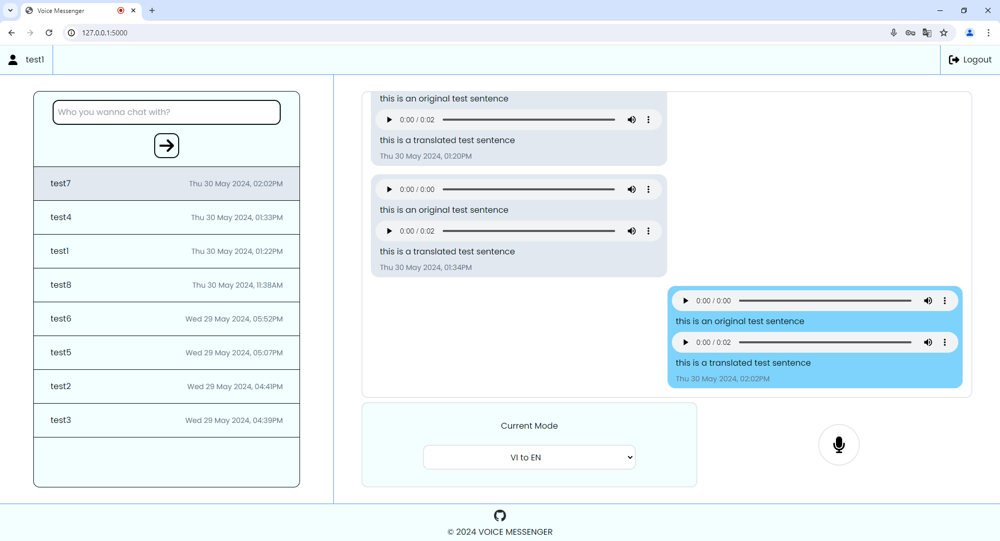

# Basic chatroom website using voice translation to translate voice chat
- In use with [this voice translation project](https://github.com/PhanNhat0209/PBL5) 
- Currently support EN to VI and VI to EN voice translation
- Basic user register/login/logout feature
- Chat room between users
- Can be modified to become a normal chatroom website

